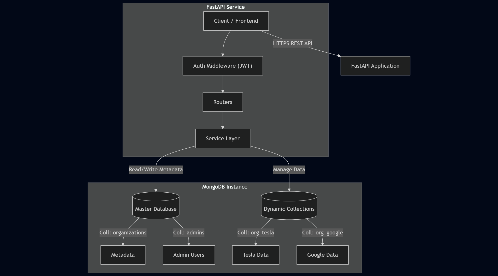

# Organization Management Service

A backend service built with **FastAPI** and **MongoDB** designed to manage organizations in a multi-tenant architecture. This system implements a **"Database-per-Tenant"** (specifically Collection-per-Tenant) strategy, where each organization gets its own dedicated collection for data isolation.

**🟢 Live Demo:** https://organization-service-g65l.onrender.com
**📄 API Docs:** https://organization-service-g65l.onrender.com/docs

## 🚀 Features

*   **Multi-Tenancy:** automatically creates a dynamic MongoDB collection (`org_<name>`) for every new organization.
*   **Authentication:** Secure Admin login using **JWT (JSON Web Tokens)**.
*   **Security:** Passwords are hashed using **Bcrypt**.
*   **CRUD Operations:** Full lifecycle management (Create, Read, Update, Delete) for organizations.
*   **Data Sync:** Automatically handles collection renaming and metadata updates when an organization is updated.
*   **Async/Await:** Fully asynchronous database operations using the **Motor** driver.

## 🛠️ Tech Stack

*   **Language:** Python 3.9+
*   **Framework:** FastAPI
*   **Database:** MongoDB
*   **Driver:** Motor (AsyncIOMotorClient)
*   **Validation:** Pydantic
*   **Auth:** Python-Jose (JWT) & Passlib (Bcrypt)
*   **Deployment:** Render
---

## ⚙️ Setup & Installation

### 1. Prerequisites
*   Python installed.
*   MongoDB installed and running locally on port `27017`.

### 2. Clone and Install Dependencies
```bash
# Clone the repository
git clone <your-repo-link-here>
cd organization_service

# Create virtual environment (Optional but recommended)
python -m venv venv
# Windows:
.\venv\Scripts\activate
# Mac/Linux:
source venv/bin/activate

# Install dependencies
pip install -r requirements.txt
```

### 3. Environment Configuration
Create a .env file in the root directory. You can copy the example below:
```bash
# .env file content
MONGO_URI=mongodb://localhost:27017
# Generate a strong key using: python -c "import secrets; print(secrets.token_hex(32))"
SECRET_KEY=7b4c9a2d3f1e5g6h7i8j9k0l1m2n3o4p5q6r7s8t9u0v1w2x3y4z5a6b7c8d9e
```


### 4. Run the Application
Start the server using Uvicorn:
```bash
uvicorn app.main:app --reload
```
The application will start at http://127.0.0.1:8000.

### 📖 API Documentation
The project provides an interactive Swagger UI for testing endpoints.

1. Navigate to http://127.0.0.1:8000/docs
2. Create Organization: Use POST /org/create.
3. Login: Use POST /admin/login to get an access token.
4. Authorize: Click the "Authorize" button in the top right, and paste your Token.
5. Manage: You can now access the protected UPDATE and DELETE endpoints. 

The project provides an interactive Swagger UI for testing endpoints.
*   **👉 Live URL:** https://organization-service-g65l.onrender.com/docs
*   **👉 Local URL:** http://127.0.0.1:8000/docs

*  How to Test:
1. **Create** Organization: Use POST /org/create.
2. **Login:** Use POST /admin/login to get an access token.
3. **Authorize:** Click the "Authorize" button in the top right, and paste your Token.
4. **Manage:** You can now access the protected UPDATE and DELETE endpoints.
### Key Endpoints
#### Auth Required : 
    POST	 /org/create	Register a new Org & Create Dynamic Collection	❌ No
    POST	 /admin/login	Login as Admin & Get JWT Token	                ❌ No
    GET	     /org/get	    Fetch Organization Metadata	                    ❌ No
    PUT	     /org/update	Update Org Name/Email (Renames Collection)	    ✅ Yes
    DELETE	 /org/delete	Delete Org & Drop Collection	                ✅ Yes

### 📐 Architecture Diagram
Below is the high-level architecture of the system:


### 💡 Design Decisions & Trade-offs
1. Is this a scalable design?

The "Collection per Tenant" architecture is a valid strategy for strict data isolation, but it has specific scalability limits.

• Pros: Excellent security (hard isolation), easy to backup/restore specific clients, and simple cleanup (drop collection).

• Cons: MongoDB has limits on the number of namespaces (collections). If the service scales to 10,000+ organizations, having 10,000+ collections can degrade cluster performance and increase RAM usage for metadata management.

2. Trade-offs with the Tech Stack

• FastAPI: Chosen for its asynchronous capabilities, which pairs perfectly with MongoDB's Motor driver for non-blocking I/O.

• MongoDB: The flexible schema is great for dynamic needs. However, ensuring data consistency between the "Master Metadata" and the "Dynamic Collections" requires careful error handling, as MongoDB does not support cross-database transactions in standalone mode.

• Renaming Strategy: The "Update Organization" feature relies on MongoDB's renameCollection. This is efficient within the same database node but would become a heavy operation (copy-paste) if the system were sharded across different physical servers.

3. Better Design Suggestion for High Scale
For a hyper-scalable SaaS, a Shared Collection with Discriminator pattern is often better.

• Instead of org_A, org_B, etc., use one large Items collection.
• Every document includes an organization_id field.
• Benefit: Only one collection to index and manage. Infinite scalability via Sharding based on organization_id.


